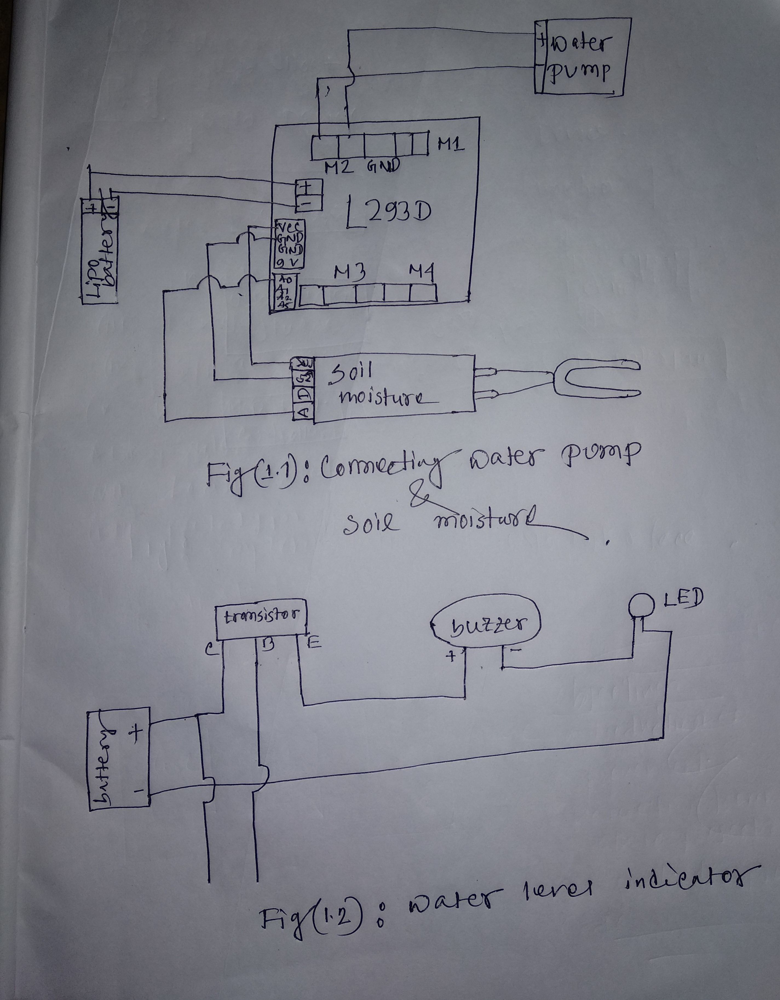

# Automatic_Watering_System for plants using Arduino_Uno
 ## Introduction
 ``` 
  In this project, we are talking about an automated system that includes whole watering system.

An automated watering system is such a system that starts watering to plants by measuring soil moisture through soil moisture sensor. In this project we will have some extra benefits. We don’t need to control this watering, because the device will make this automatically when it will need it.
```

## Circuit Diagram

### Project Code

```
#include <AFMotor.h>
// DC motor on M2
AF_DCMotor motor(2);
void setup() {
  Serial.begin(9600);          
  motor.setSpeed(1000);
  motor.run(RELEASE);
}
void loop()
{int sensorValue = analogRead(A0);
  Serial.println(sensorValue);
  delay(1);       
if(sensorValue>300)
{
motor.run(FORWARD);
}
else
motor.run(RELEASE);
}
```
### Project Viedo: Good quality Viedo(https://www.youtube.com/watch?v=l9Tq66V6m7Q)


[](https://www.youtube.com/watch?v=l9Tq66V6m7Q)

## Project Description Link: https://create.arduino.cc/projecthub/Saikan45/automated-watering-plant-f853d8?ref=user&ref_id=1150184&offset=0

